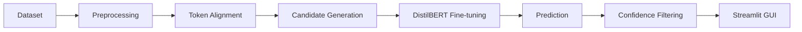

# Urdu Spelling Correction with DistilBERT

Context-aware Urdu token-level spelling correction using a fine-tuned multilingual DistilBERT classifier and an interactive Streamlit demo.

## Project Overview

This project builds an Urdu spelling correction pipeline for noisy social-media text. It learns from paired Urdu tweets where an original sentence is aligned with a processed/corrected version, then trains a model to predict the corrected token from sentence context.

Urdu spelling correction is challenging because the text is noisy, informal, morphologically rich, and written with Unicode variants that often need normalization before modeling. The project addresses this with a reproducible preprocessing pipeline, token alignment, correction-class filtering, transformer fine-tuning, and a local GUI for demonstration.

## Highlights

- Fine-tuned multilingual DistilBERT for Urdu spelling correction
- Context-aware correction using marked candidate tokens
- Interactive Streamlit GUI
- Hugging Face model available for download
- Complete preprocessing and training pipeline
- Technical report documenting methodology and experiments

**Tech stack:** Python, pandas, scikit-learn, PyTorch, Hugging Face Transformers, DistilBERT, Streamlit, TensorFlow/Keras for notebook baselines.

## Demo

The repository includes an interactive Streamlit interface for entering an Urdu sentence, scanning possible correction candidates, and displaying the model's suggested correction with confidence scores.


Run the demo locally:

```bash
python -m streamlit run app.py
```

## Features

- Urdu text cleaning and Unicode normalization
- Token-level alignment between original and corrected tweet text
- Candidate token scanning for sentence-level inference
- Fine-tuned multilingual DistilBERT correction classifier
- Explicit wrong-token markers: `[WRONG] ... [/WRONG]`
- Top-k correction suggestions with confidence scores
- Confidence threshold control in the Streamlit UI
- Saved evaluation metrics and test predictions
- Reproducible training script with validation monitoring and class-weighted loss

## Methodology

The final implemented pipeline focuses on basic token-level spelling correction.



| Stage | Description |
| --- | --- |
| Dataset | Uses `data/raw/UrduSpellDataset.csv`, containing original Urdu tweets and processed/corrected tweets. |
| Preprocessing | Removes URLs, mentions, hashtags, Latin characters, digits, and non-Urdu punctuation; normalizes Urdu Unicode variants. |
| Token Alignment | Uses token sequence alignment to extract changed tokens from original and processed tweet pairs. |
| Candidate Generation | Uses one-to-one token replacements for training; at inference time, each Urdu token can be scanned as a possible correction candidate. |
| DistilBERT Fine-tuning | Fine-tunes `distilbert-base-multilingual-cased` as a correction-class classifier. |
| Prediction | Predicts the corrected token label for a marked candidate word. |
| Confidence Filtering | Ranks candidates by model confidence and applies a configurable threshold. |
| Streamlit GUI | Provides a local interface for sentence input, correction output, top suggestions, and scanned candidates. |

## Model

| Item | Implementation |
| --- | --- |
| Base model | `distilbert-base-multilingual-cased` |
| Task type | Multi-class sequence classification |
| Input representation | Marked sentence + wrong token as paired tokenizer input |
| Wrong-token markers | `[WRONG]` and `[/WRONG]` are added around the candidate token |
| Objective | Predict `CorrectWord` from the filtered correction label set |
| Training script | `src/train_distilbert.py` |
| Loss | Class-weighted cross-entropy with label smoothing |
| Optimizer | AdamW with weight decay and linear warmup schedule |
| Inference | `src/predict_correction.py` scans tokens, ranks candidate corrections, and returns top suggestions |

The model is saved in Hugging Face format under:

```text
outputs/distilbert/model/
```

## Experimental Results

Current saved DistilBERT results from `outputs/distilbert/metrics.csv`:

| Model | Accuracy | Precision | Recall | F1-score | Top-3 Accuracy |
| --- | ---: | ---: | ---: | ---: | ---: |
| DistilBERT current script | 0.7183 | 0.7218 | 0.7183 | 0.7103 | 0.8451 |

Several models were evaluated during development, including:

- TF-IDF + `SGDClassifier`
- TF-IDF + `MultinomialNB`
- TF-IDF + `LinearSVC`
- Simple RNN
- LSTM
- Earlier DistilBERT implementation

The final script-based DistilBERT implementation achieved the strongest overall recorded performance in the current project outputs, especially on Top-1 accuracy and Top-3 correction ranking.

## Repository Structure

```text
NLP project/
|-- app.py                         # Streamlit correction demo
|-- requirements.txt               # Python dependencies
|-- data/
|   |-- raw/                       # Original Urdu dataset
|   `-- processed/                 # Generated token-change CSV files
|-- docs/                          # Methodology and project documentation
|-- notebooks/
|   `-- project_1.ipynb            # Exploratory experiments and baselines
|-- outputs/
|   |-- distilbert/                # Metrics, predictions, labels, model folder
|   `-- assets/                   # used images
`-- src/
    |-- scan_real_world_errors.py  # Dataset cleaning and token-change extraction
    |-- train_distilbert.py        # Reproducible DistilBERT training script
    `-- predict_correction.py      # CLI/inference utilities
```

## Installation

1. Clone the repository:

```bash
git clone <repository-url>
cd "NLP project"
```

2. Create and activate a virtual environment:

```bash
python -m venv .venv
.venv\Scripts\activate
```

3. Install dependencies:

```bash
pip install -r requirements.txt
```

4. Download the trained model and place it here:

```text
outputs/distilbert/model/
```

5. Confirm the expected files exist:

```text
outputs/distilbert/model/config.json
outputs/distilbert/model/model.safetensors
outputs/distilbert/model/tokenizer.json
outputs/distilbert/label_classes.json
```

6. Launch the Streamlit app:

```bash
python -m streamlit run app.py
```

Optional: verify the training data split without training:

```bash
python src/train_distilbert.py --dry-run
```

## Model Download

The trained DistilBERT model is **not included in this GitHub repository** because of its size.

Download the trained model from Hugging Face:

**Hugging Face:**  
https://huggingface.co/HuzaifaQ-12/Urdu_spelling_correction

After downloading, place the model files in:

```text
outputs/distilbert/model/
```

The application also requires:

```text
outputs/distilbert/label_classes.json
```

If you prefer, you can retrain the model locally using:

```bash
python src/train_distilbert.py
```
## Technical Documentation

This README provides a high-level overview for quick portfolio review. For implementation details, preprocessing logic, model architectures, experiments, hyperparameters, training procedure, evaluation, limitations, and design decisions, refer to the accompanying technical report:

**`docs/Urdu_Basic_Spelling_Correction_Current_Code_Report.pdf`**


## Future Improvements

- Train on a larger Urdu correction corpus
- Add more correction classes while controlling class imbalance
- Improve candidate generation and candidate ranking
- Train a dedicated token-level error detector instead of scanning every token
- Evaluate on additional Urdu datasets
- Explore sequence-to-sequence transformer models for broader correction coverage

